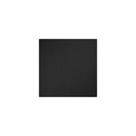
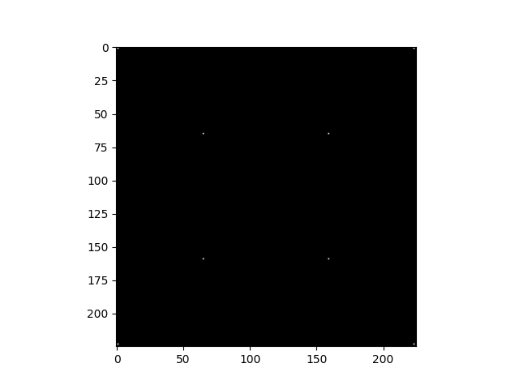
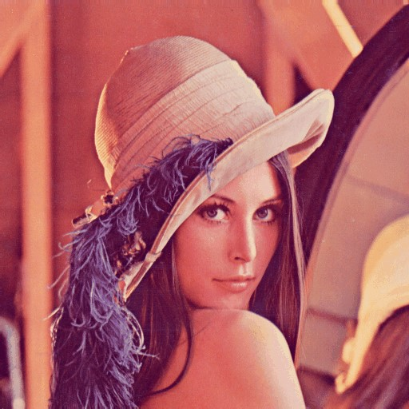
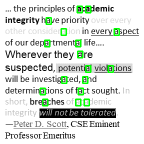
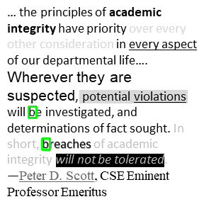

# Computer Vision Algorithms (From Scratch)

Note: This project was built purely as a personal exercise to better understand and gain intuition about classical computer vision algorithms. It is not intended as a production-level system.

A collection of classic computer vision algorithms implemented **from scratch in Python** using only NumPy and basic OpenCV for image I/O and visualization.

The goal of this project is to deeply understand the mathematical foundations behind fundamental computer vision techniques by implementing them without relying on high-level OpenCV functions.

---

## Implemented Algorithms

### 1. Harris Corner Detection
Detects interest points (corners) using the Harris response function.

**Key Features:**
- Sobel gradient computation
- Gaussian smoothing of structure tensor components
- Harris response calculation
- Non-maximum suppression

**Module:** `harris_corner/`

---

### 2. Canny Edge Detection
A complete multi-stage edge detection pipeline.

**Pipeline:**
1. Gaussian smoothing  
2. Gradient computation (Sobel filters)  
3. Non-maximum suppression  
4. Double thresholding  
5. Edge tracking by hysteresis  

**Module:** `canny_edge/`

---

### 3. Laplacian Pyramid
Multi-scale image representation using Gaussian and Laplacian pyramids.

**Features:**
- Gaussian pyramid construction
- Laplacian pyramid computation
- Image reconstruction
- Visualization of pyramid levels

**Module:** `laplacian_pyramid/`

---

### 4. Character / Object Detection (Template Matching)
Sliding-window based detection using template matching with optional edge-weighted scoring.

**Features:**
- Multi-scale detection support
- Weighted Normalized Cross-Correlation (NCC)
- Edge-aware weighting using Canny detector
- Template averaging from multiple samples
- Non-Maximum Suppression (NMS)

**Module:** `template_matching_ncc/`

### 5. Object Detection (HOG + Cosine Similarity)

A more robust object detection pipeline using Histogram of Oriented Gradients (HOG) features with Cosine similarity-based classifier for decision making.

**Key Features:**
- HOG feature extraction from image patches
- Sliding window detection
- Cosine similarity-based classifier
- More robust to shape variation compared to template matching (NCC)
- Optional multi-scale detection
- Non-Maximum Suppression (NMS)

**Module:** `object_detection_hog/`
---

## Project Structure

```
computer-vision-algorithms/
├── run.py                          # Main runner script
├── common/
│   └── kernel.py                   # Gaussian & Sobel kernels + convolution
├── harris_corner/
│   ├── harris.py
│   └── demo.py
├── canny_edge/
│   ├── canny.py
│   └── demo.py
├── laplacian_pyramid/
│   ├── laplacian_pyramid.py
│   └── demo.py
├── template_matching_ncc/
│   ├── ncc_detector.py
│   └── demo.py
├── object_detection_hog/
│   ├── hog_descriptor.py        # feature extraction
│   ├── hog_object_detector.py   # detection pipeline
│   ├── classifier.py
│   ├── utils.py
│   └── demo.py
├── data/                           # Sample images (lena, square, test.png, characters, etc.)
└── README.md
```

## Requirements

```bash
pip install numpy matplotlib opencv-python
```


## How to Run
Using the central runner:
Bash

# Harris Corner Detection
```bash
python -m harris_corner.demo
```

# Canny Edge Detection
```bash
python -m canny_edge.demo
```

# Laplacian Pyramid
```bash
python -m laplacian_pyramid.demo
```

# Template Matching (NCC)
```bash
python -m template_matching_ncc.demo
```

# Object Detection (HOG + Cosine Similarity)
```bash
python -m object_detection_hog.demo
```
## Goals of the Project

Implement classical computer vision algorithms from scratch (no high-level OpenCV functions like cv2.Canny or cv2.cornerHarris)
Understand the mathematical foundations behind each method
Build modular and reusable code structure
Visualize intermediate and final results clearly

## Detection Pipeline Evolution

This project implements a progression of object detection methods:

1. Template Matching (pixel-level similarity)
2. HOG-based feature representation
3. Cosine similarity-based classifier for decision making

This demonstrates the transition from raw pixel comparison to feature-based representations.

## Future Improvements (Ideas)

Improve HOG-based object detection classifier (currently using cosine similarity)
Improve Non-Maximum Suppression (NMS)
Implement SIFT-like keypoint detection
Optical flow implementation
Image stitching / panorama creation
Real-time webcam demos

## Example Results

Here are some sample outputs from the implemented algorithms:

### Harris Corner Detection vs Original

| Original Image | Detected Corners |
|----------------|------------------|
|  |  |

### Canny Edge Detection
| Original Image | Detected Edges |
|----------------|----------------|
|  |  |

|----------------|------------------|
|  |  |


### Laplacian Pyramid


### NCC Template Matching



