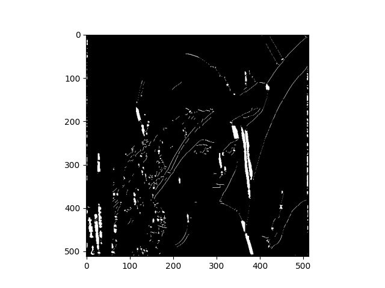
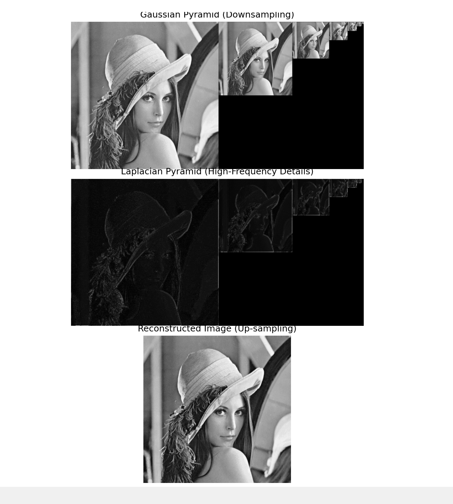
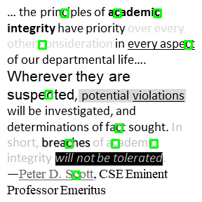

# Computer Vision Algorithms (From Scratch)

A collection of classic computer vision algorithms implemented **from scratch in Python** using only NumPy and basic OpenCV for image I/O and visualization. The main goal of this project is to deeply understand the mathematical foundations and implementation details of fundamental CV techniques.

---

## Implemented Algorithms

### 1. Harris Corner Detection
Detects interest points (corners) using the Harris response function.

**Features:**
- Sobel gradient computation
- Gaussian smoothing of structure tensor components
- Harris corner response calculation
- Non-maximum suppression

**Module:** `harris_corner/`

### 2. Canny Edge Detection
A complete multi-stage edge detector.

**Pipeline:**
1. Gaussian smoothing
2. Gradient computation using Sobel filters
3. Non-maximum suppression
4. Double thresholding
5. Edge tracking by hysteresis

**Module:** `canny_edge/`

### 3. Laplacian Pyramid
Multi-scale image representation using Gaussian and Laplacian pyramids.

**Features:**
- Gaussian pyramid construction
- Laplacian pyramid computation
- Image reconstruction from pyramid levels
- Visualization of all pyramid levels

**Module:** `laplacian_pyramid/`

### 4. Character/Object Detection (Template Matching)
Simple sliding-window template matching with optional edge-weighted scoring.

**Features:**
- Multi-scale detection support
- Weighted Normalized Cross-Correlation (NCC) using Canny edge weights
- Template combination from multiple samples

**Module:** `character_detection/`

---

## Project Structure
computer-vision-algorithms/
├── run.py                          
├── common/
│   └── kernel.py                   
├── harris_corner/
│   ├── harris.py
│   └── demo.py
├── canny_edge/
│   ├── canny.py
│   └── demo.py
├── laplacian_pyramid/
│   ├── laplacian_pyramid.py
│   └── demo.py
├── character_detection/
│   ├── detector.py
│   └── demo.py
├── data/                         
└── README.md
text---

## Requirements
```bash
pip install numpy matplotlib opencv-python``
```
How to Run
Using the main runner:
# Harris Corner Detection
python run.py --method harris

# Canny Edge Detection
python run.py --method canny

# Laplacian Pyramid
python run.py --method pyramid

# Character Detection
python run.py --method detect

Running individual modules:
python -m harris_corner.demo
python -m canny_edge.demo
python -m laplacian_pyramid.demo
python -m character_detection.demo

Goals of the Project

Implement classical computer vision algorithms without relying on high-level OpenCV functions (e.g., no cv2.Canny() or cv2.cornerHarris())
Build a solid understanding of the underlying mathematics
Create modular and reusable code components
Provide clear visualizations for each algorithm


Future Improvements (Ideas)

Add proper Non-Maximum Suppression + NMS for object detection
Implement full HOG + SVM detector
Add SIFT-like keypoint detection and descriptor
Image stitching / panorama creation
Optical flow
Real-time webcam demonstrations

## Example Results

Here are some sample outputs from the implemented algorithms:

### Harris Corner Detection vs Original

| Original Image | Detected Corners |
|----------------|------------------|
|  |  |

### Canny Edge Detection
| Original Image | Detected Edges |
|----------------|------------------|
|  |  |


### Laplacian Pyramid


### Character Detection

